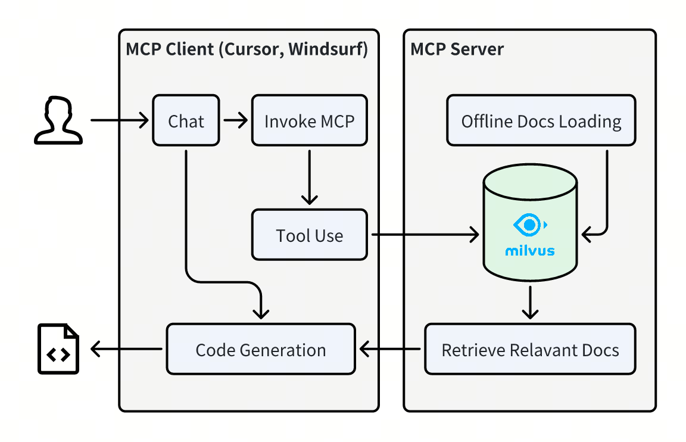

# mcp-pymilvus-code-generate-helper
> A Model Context Protocol server that retrieves relevant code snippets or documents to help generating pymilvus code.




## Prerequisites

Before using this MCP server, ensure you have:

- Python 3.10 or higher
- A running [Milvus](https://milvus.io/) instance (local or remote)
- [uv](https://github.com/astral-sh/uv) installed (recommended for running the server)

## Quick Start with FastMCP

The recommended way to use this MCP server is through FastMCP, which provides better performance and easier configuration.

### First Time Setup (with Document Update)

For the first time running the server, use the main FastMCP server which will automatically update the document database:

```bash
uv run src/mcp_pymilvus_code_generate_helper/fastmcp_server.py
```

This will:
- Connect to your Milvus instance (default: http://localhost:19530)
- Download and process the latest Milvus documentation
- Start the MCP server with all three tools available

#### Custom Configuration

```bash
# Connect to remote Milvus server
uv run src/mcp_pymilvus_code_generate_helper/fastmcp_server.py --milvus_uri http://your-server:19530 --milvus_token your_token

# Change server host and port
uv run src/mcp_pymilvus_code_generate_helper/fastmcp_server.py --host 0.0.0.0 --port 8080

# Use different transport (default is http)
uv run src/mcp_pymilvus_code_generate_helper/fastmcp_server.py --transport sse
```

### Subsequent Runs (Lightweight Mode)

After the initial setup, you can use the lightweight FastMCP server for faster startup:

```bash
uv run examples/fastmcp_server.py
```

This lightweight version:
- Skips document synchronization
- Starts immediately without background tasks
- Assumes documents are already loaded in Milvus

#### Lightweight Server Options

```bash
# Custom configuration for lightweight server
uv run examples/fastmcp_server.py --milvus_uri http://your-server:19530 --host 0.0.0.0 --port 8080 --transport http
```

### Usage with Cursor

1. Go to `Cursor` > `Settings` > `MCP`
2. Click on the `+ Add New Global MCP Server` button
3. Configure based on your chosen mode:

#### For HTTP Transport (Recommended)
```json
{
  "mcpServers": {
    "pymilvus-code-generate-helper": {
      "url": "http://localhost:8000/mcp"
    }
  }
}
```

#### For SSE Transport
```json
{
  "mcpServers": {
    "pymilvus-code-generate-helper": {
      "url": "http://localhost:8000"
    }
  }
}
```

#### For STDIO Transport
```json
{
  "mcpServers": {
    "pymilvus-code-generate-helper": {
      "command": "/PATH/TO/uv",
      "args": [
        "--directory",
        "/path/to/mcp-pymilvus-code-generate-helper",
        "run",
        "examples/fastmcp_server.py",
        "--transport",
        "stdio",
        "--milvus_uri",
        "http://localhost:19530"
      ],
      "env": {
        "OPENAI_API_KEY": "YOUR_OPENAI_API_KEY"
      }
    }
  }
}
```

### Usage with Claude Desktop

1. Install Claude Desktop from https://claude.ai/download
2. Open your Claude Desktop configuration:
   - macOS: `~/Library/Application Support/Claude/claude_desktop_config.json`
   - Windows: `%APPDATA%\Claude\claude_desktop_config.json`
3. Add the following configuration:

#### For HTTP Transport
```json
{
  "mcpServers": {
    "pymilvus-code-generate-helper": {
      "url": "http://localhost:8000/mcp"
    }
  }
}
```

#### For STDIO Transport
```json
{
  "mcpServers": {
    "pymilvus-code-generate-helper": {
      "command": "/PATH/TO/uv",
      "args": [
        "--directory",
        "/path/to/mcp-pymilvus-code-generate-helper",
        "run",
        "examples/fastmcp_server.py",
        "--transport",
        "stdio",
        "--milvus_uri",
        "http://localhost:19530"
      ],
      "env": {
        "OPENAI_API_KEY": "YOUR_OPENAI_API_KEY"
      }
    }
  }
}
```

4. Restart Claude Desktop

> ⚠️ **Note**: Remember to set the `OPENAI_API_KEY` environment variable when using STDIO transport.

## Available Tools

The server provides three powerful tools for Milvus code generation and translation:

### 1. `milvus_code_generator`
Generate or provide sample PyMilvus/Milvus code based on natural language input.

- **When to use**: Code generation, sample code requests, "how to write" queries
- **Parameters**: 
  - `query`: Your natural language request for code generation
- **Example**: "Generate pymilvus code for hybrid search"


### 2. `orm_client_code_convertor`
Convert between ORM and PyMilvus client code formats.

- **When to use**: Converting between ORM and client styles, format adaptation
- **Parameters**:
  - `query`: List of Milvus API names to convert (e.g., `["create_collection", "insert"]`)
- **Example**: "Convert ORM code to PyMilvus client"


### 3. `milvus_code_translator`
Translate Milvus code between different programming languages.

- **When to use**: Cross-language code translation
- **Parameters**:
  - `query`: List of Milvus API names in escaped double quotes format (e.g., `[\"create_collection\", \"insert\", \"search\"]`)
  - `source_language`: Source programming language (python, java, go, csharp, node, restful)
  - `target_language`: Target programming language (python, java, go, csharp, node, restful)
- **Example**: "Translate Python Milvus code to Java"


> ⚠️ **Important**: You don't need to specify tool names or parameters manually. Just describe your requirements naturally, and the MCP system will automatically select the appropriate tool and prepare the necessary parameters.

## Legacy Transport Modes

For backward compatibility, the server also supports SSE and STDIO transport modes:

### SSE Transport
```bash
# Start SSE server
uv run src/mcp_pymilvus_code_generate_helper/sse_server.py --milvus_uri http://localhost:19530

# Cursor configuration for SSE
{
  "mcpServers": {
    "pymilvus-code-generate-helper": {
      "url": "http://localhost:23333/milvus-code-helper/sse"
    }
  }
}
```

### STDIO Transport
```bash
# Start STDIO server
uv run src/mcp_pymilvus_code_generate_helper/stdio_server.py --milvus_uri http://localhost:19530

# Cursor configuration for STDIO
{
  "mcpServers": {
    "pymilvus-code-generate-helper": {
      "command": "/PATH/TO/uv",
      "args": [
        "--directory",
        "/path/to/mcp-pymilvus-code-generate-helper",
        "run",
        "src/mcp_pymilvus_code_generate_helper/stdio_server.py",
        "--milvus_uri",
        "http://localhost:19530"
      ],
      "env": {
        "OPENAI_API_KEY": "YOUR_OPENAI_API_KEY"
      }
    }
  }
}
```

## Docker Support

You can also run the server using Docker:

### Build the Docker Image
```bash
docker build -t milvus-code-helper .
```

### Run with FastMCP (Recommended)
```bash
# First time run with document update
docker run -p 8000:8000 \
  -e OPENAI_API_KEY=your_openai_key \
  -e MILVUS_URI=http://your-milvus-host:19530 \
  -e MILVUS_TOKEN=your_milvus_token \
  milvus-code-helper

# Lightweight mode for subsequent runs
docker run -p 8000:8000 \
  -e OPENAI_API_KEY=your_openai_key \
  -e MILVUS_URI=http://your-milvus-host:19530 \
  -e MILVUS_TOKEN=your_milvus_token \
  milvus-code-helper examples/fastmcp_server.py
```

## Configuration Options

### Server Parameters

| Parameter | Description | Default |
|-----------|-------------|---------|
| `--milvus_uri` | Milvus server URI | `http://localhost:19530` |
| `--milvus_token` | Milvus authentication token | `""` |
| `--db_name` | Milvus database name | `default` |
| `--host` | Server host address | `0.0.0.0` |
| `--port` | Server port | `8000` |
| `--path` | HTTP endpoint path | `/mcp` |
| `--transport` | Transport protocol | `http` |

### Transport Options

- **`http`**: RESTful HTTP transport (recommended)
- **`sse`**: Server-Sent Events transport
- **`stdio`**: Standard input/output transport

### Environment Variables

- `OPENAI_API_KEY`: Required for document processing and embedding generation
- `MILVUS_URI`: Alternative way to specify Milvus server URI
- `MILVUS_TOKEN`: Alternative way to specify Milvus authentication token

## Troubleshooting

### Common Issues

1. **Connection refused**: Ensure Milvus is running and accessible
2. **Authentication failed**: Check your Milvus token and credentials
3. **Port conflicts**: Change the port using `--port` parameter
4. **Missing documents**: Run the full server first to populate the database

### Debug Mode

Enable debug logging:
```bash
PYTHONPATH=src python -m logging --level DEBUG src/mcp_pymilvus_code_generate_helper/fastmcp_server.py
```

## Contributing

Contributions are welcome! If you have ideas for improving the retrieval results or adding new features, please submit a pull request or open an issue.

## License

This project is licensed under the MIT License.
